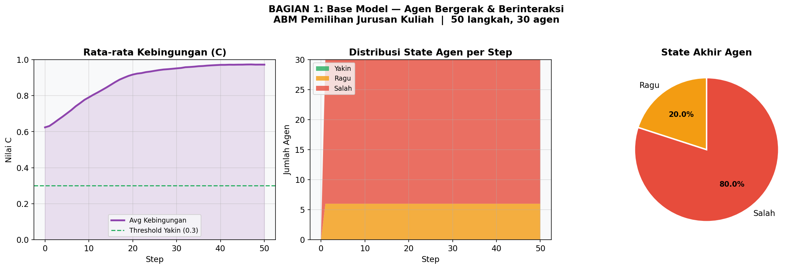
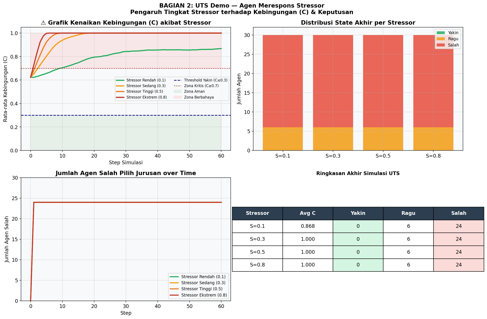
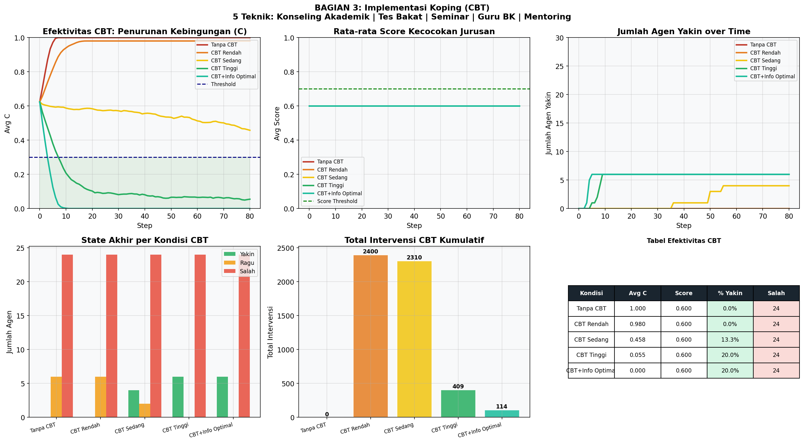
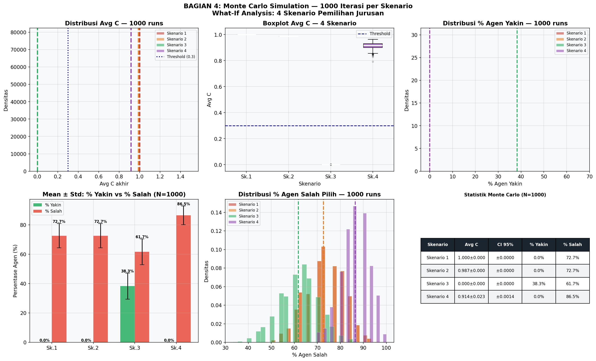

# 🎓 Simulasi Agent-Based Modeling (ABM) Pemilihan Jurusan Kuliah


[](https://colab.research.google.com/github/rifqidzaki/Project-Pemodelan-Simulasi-Data/blob/main/Simulasi_Jurusan_ABM.ipynb)

Proyek ini adalah simulasi berbasis **Agent-Based Modeling (ABM)** yang mensimulasikan dinamika psikologis dan sosial calon mahasiswa dalam menentukan jurusan kuliah. Dibangun menggunakan framework **Mesa** di Python, model ini menganalisis bagaimana kebingungan (confusion) dapat berujung pada pemilihan jurusan yang salah, dan bagaimana intervensi seperti *Cognitive Behavioral Therapy (CBT)* dapat memitigasinya.

---

## 🎯 Tujuan Proyek
- Menggambarkan proses pengambilan keputusan agen berdasarkan **Minat**, **Kemampuan**, dan **Pengaruh Sosial**.
- Menganalisis dampak tingkat **Stres** lingkungan terhadap rasio pemilihan jurusan yang salah.
- Mengukur efektivitas intervensi konseling akademik (**CBT**) dalam menurunkan tingkat kebingungan calon mahasiswa.
- Melakukan analisis ketahanan model melalui simulasi **Monte Carlo** dengan 1000 iterasi.

---

## 🔬 Fitur & Simulasi Utama

### 1. Pergerakan dan Interaksi Dasar (Base Model)
Agen calon mahasiswa bergerak secara acak di dalam grid dan berinteraksi satu sama lain. Agen yang merasa "Yakin" akan menularkan ketenangan dan menurunkan kebingungan agen di sekitarnya, sedangkan agen yang "Salah Jurusan" akan menyebarkan kepanikan.
> 

### 2. Respon terhadap Tekanan (Stressor)
Simulasi dijalankan di bawah 4 tingkat stres berbeda (Rendah, Sedang, Tinggi, Ekstrem). Hasilnya membuktikan bahwa semakin tinggi stres lingkungan (tanpa bantuan yang memadai), persentase siswa yang salah memilih jurusan melonjak drastis.
> 

### 3. Implementasi Koping & Konseling (CBT)
Model ini mensimulasikan 5 bentuk intervensi yang berjalan secara otonom saat kebingungan agen memuncak:
- Konseling Akademik
- Tes Minat & Bakat
- Seminar Jurusan
- Konsultasi Guru BK
- Mentoring Sesama Siswa
> 

### 4. Analisis Monte Carlo (What-If Scenarios)
Untuk memvalidasi temuan secara statistik, simulasi dijalankan sebanyak **1000 kali iterasi** dalam 4 skenario ekstrem yang berbeda. Data menunjukkan dengan interval kepercayaan (Confidence Interval) 95% bahwa intervensi ganda (informasi tinggi & CBT) adalah strategi paling efektif untuk menekan angka salah jurusan.
> 

---

## 📂 Struktur Repositori

```text
📁 Project/
│
├── Simulasi_Jurusan_ABM.ipynb  # Source code lengkap & Jupyter Notebook
├── requirements.txt            # Daftar dependensi library
├── monte_carlo_results.csv     # Raw data dari 1000 iterasi Monte Carlo (N=1000)
├── summary_results.csv         # Ringkasan analitik statistik
├── fig1_base_model.png         # Ekspor visualisasi
├── fig2_uts_demo.png
├── fig3_cbt.png
├── fig4_monte_carlo.png
├── README.md                   # Dokumentasi repositori ini
└── LICENSE                     # Lisensi MIT
```

---

## 🚀 Cara Menjalankan Secara Lokal

1. **Clone repositori ini:**
   ```bash
   git clone https://github.com/username/Simulasi-Jurusan-ABM.git
   cd Simulasi-Jurusan-ABM
   ```

2. **Buat virtual environment (Disarankan):**
   ```bash
   python -m venv venv
   source venv/bin/activate  # Untuk Windows: venv\Scripts\activate
   ```

3. **Install dependensi:**
   ```bash
   pip install -r requirements.txt
   ```

4. **Jalankan Jupyter Notebook:**
   ```bash
   jupyter notebook Simulasi_Jurusan_ABM.ipynb
   ```
   *Pilih Run All Cells untuk melihat simulasi berjalan.*

---

## 👨‍💻 Tentang Pembuat
Proyek ini dibuat sebagai bentuk portofolio dalam mata kuliah Pemodelan dan Simulasi Data. Proyek ini memadukan konsep sosiopsikologi, *computational modeling*, dan *data science* untuk merumuskan kebijakan akademik yang *data-driven*.

*Mari terhubung jika Anda tertarik dengan Computational Social Science atau Data Science!*
